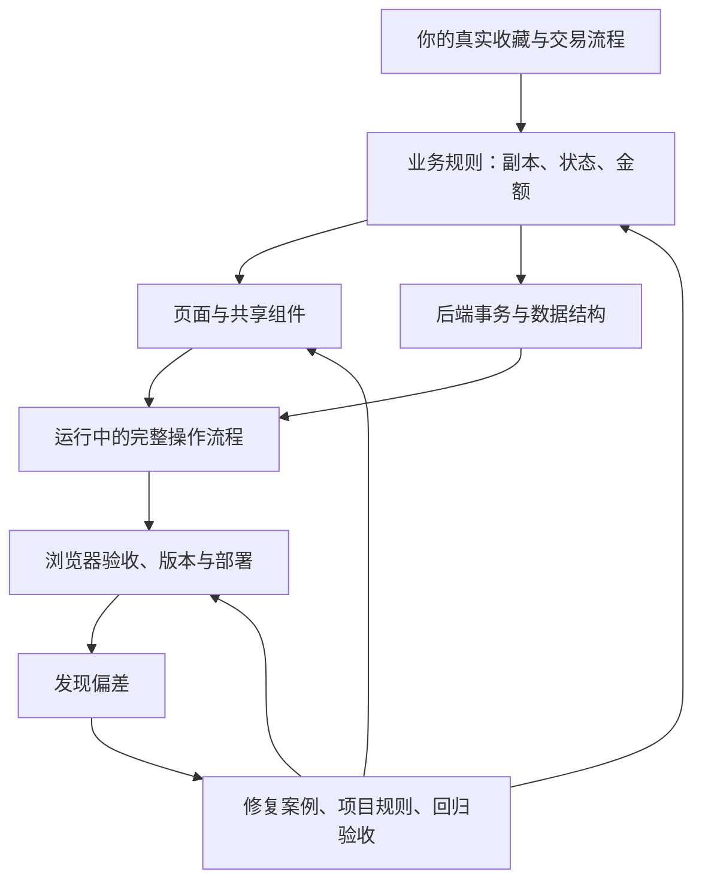

# 碟渡：AI 开发复盘与后续开发注意事项

复盘日期：2026-09-30。面向项目使用者与后续开发 agent。

你在这个项目里反复补充的细节，大多可以归入几条稳定的产品原则：按真实交易过程组织信息、减少录入、相同交互共用实现、自动化尊重人工输入、金额能追溯、修改必须在实际运行的应用里生效。

反复沟通不能全部归因于需求不完整。这里同时发生了**需求演进、对需求的误解、实现缺陷、交付验证缺口**。例如新增实物照片属于需求演进；把艺人分组画成时间轴属于设计误解；自动匹配删掉标题末尾的数字属于实现缺陷；新界面调用旧后端属于交付问题。区分它们，才能知道下一次应该补业务定义、调整实现，还是补验收。

## 阅读与证据边界

- 本文核对了可恢复的早期 Codex 原始对话、近期本项目相关开发会话、当前代码、现有测试和项目标准；会话来源索引见文末。
- 当前 Git 只有框架基线及两次后续提交，不能用它还原此前全部开发过程。下列日期来自开发对话，按日本时间整理。
- **历史修复**表示当时对话记录了修复及验证；**当前源码支持**表示本次在代码中找到了对应实现；**待核查**表示仍有实现缺口或需要浏览器复现。三者不能混用。
- 本次整理没有重跑应用、浏览器流程或后端测试，因此不把历史测试结果称为今天的运行结果。测试文件能证明验收意图和覆盖范围，不能代替一次新的测试执行。
- 下文的深层原因是根据需求、改动和故障链条作出的工程分析，不声称知道模型内部的思考过程。这是一份有证据的主题复盘，不是所有会话、错误或工时的完整统计。
- 本文只保留通用产品与工程信息，不收录个人采购、成交、账号或部署配置。关联的价格采集项目不计入碟渡自身的完成情况。

## 一、你让 AI 做了哪些方向的事情

| 方向 | 你实际推动的内容 | 最终要保证的东西 |
|---|---|---|
| 产品定位与使用效率 | 电脑管理为主、手机偶尔查看和录入；少填写；库存和已交易分开；后续改为现代深色界面、精简表单 | 高频操作直接、必要信息清楚，功能增长不增加日常负担 |
| 真实业务模型 | 独立副本；海外库存、包裹运输、国内库存、售出中、到账后的已交易；误操作回滚；上架标记 | 每个状态对应真实事件，位置、运输、售卖意图和现金结算能分清 |
| 金额与跨币种账目 | 买入当天汇率、实际人民币支出、运输费分摊、平台费和寄出运费、已实现利润、售出金额 | 原始金额可追溯、成本缺失不当零、分摊不丢钱、未到账不计已实现利润 |
| 自动化与搜索 | 自动封面；艺人目录缓存与备用源；库内模糊匹配、艺人纠错、短标题召回；历史店铺选择 | 少填但不误填，搜不到和搜错都能解释，模糊候选不能擅自改写事实 |
| 组件与视觉交互 | 下拉统一；金额框复用；浮动批量条；月份时间轴和艺人区块；副本组框；徽标、图标、抽屉和提示动画 | 同一交互共用规则，出现控件不挤页面，视觉结构表达正确含义 |
| 实物与结构化资料 | 碟盒、版次、侧标；每副本多张实物照片；灯箱；照片与记录的归属可还原 | 能区分同名专辑的不同实物，也能把资料和照片完整取出 |
| 架构与维护 | React/TypeScript 改写；页面、表单、组件和样式拆分；后端路由表、服务注入；约束写入 AGENTS.md | 新功能有明确入口，问题能定位，维护不依赖上一段聊天的记忆 |
| 交付、运行与分享 | PWA、登录、备份、健康检查、版本显示、部署回滚、Docker、框架与数据解耦、仓库防泄漏和 Release | 实际运行版本正确、数据安全、别人克隆后可独立使用 |

这些方向之间有依赖关系。组件统一服务于录入效率；状态定义决定利润何时实现；保存原币种决定以后能否正确展示；部署一致性决定新功能会不会损坏账目。

## 二、产品是怎样逐步长出来的

| 阶段 | 主要变化 | 这里容易误判的地方 |
|---|---|---|
| 9 月 7 日起：首版 | 从购买资料开始，确定少填、跨币种、库存与已售分离；采用封面列表；随后补自动封面、店铺选择和 PWA | 首版的展示选择是当时决定，不能覆盖后来的明确改版 |
| 9 月 28 日：实际交易流程 | 深色界面和更少表单；从简化状态扩展到五态、包裹、确认到账和回滚 | 起初的三态不足以表达运输与待收货，属于业务逐步明确；售出中放错层级则属于误解 |
| 9 月 29 日：收藏资料与 UI | 月份/艺人分组、独立副本、碟盒/版次/侧标、照片、紧凑抽屉、灯箱 | 新增区分实物的能力，不等于改成一个专辑统一管理多份库存 |
| 9 月 29 日晚：工程化 | React/TS、模块拆分、依赖注入、版本与发布机制、开发标准 | 重构应保留当时已有行为；只测主链路不足以证明所有交互不变 |
| 9 月 30 日：交互与自动化纠错 | 上架语义、海外售出、运费组件及原币种、标题自动匹配、封面搜索召回、统一提示 | 局部表单改对后，还要检查接口、持久化和所有展示入口 |
| 9 月 30 日：可分享框架 | Docker、数据解耦、清理一次性工具、仓库防误传、发布包 | “本机能用”和“别人能克隆部署”需要不同的验证 |

你新增需求的过程也在澄清产品。例如“未上架”不等于“自留”，“国内库存”不等于“已上架”，“售出中”不等于“已拿到现金”。这些区别决定数据模型，不能仅作为文案处理。[D2、D5]

## 三、反复纠正过的具体问题

| 案例 | 问题与直接原因 | 历史处理及本次核对 | 以后应记住的原则 |
|---|---|---|---|
| 1. 独立副本被过度库存化 | 早期 AI 从同名记录推导出多库存管理；你强调多数专辑只有一张，偶尔多张也有不同价格和版本 | 改成每副本独立记录，后来只在展示层分组；当前有独立副本测试。[D1、D2；`tests/test_ledger.py:test_duplicate_purchase_independent`] | 展示合并不能导致身份、成本或售出对象合并 |
| 2. 售出中被放错层级 | 虽然有中间状态，却仍混在交易页面；你指出它应和其他状态并列 | 增加独立售出中页面，已交易只展示确认收货后的交易；当前有售出与收货状态测试。[D2；`ShippingPage.tsx`、`TradesPage.tsx`、`test_sell_then_receive`] | 业务状态不仅要存在于数据库，也要体现在导航、统计与操作权限上 |
| 3. 已上架被解释为售卖意图 | 你补充“不上架的不一定就是不卖”，并要求海外也可上架、售出 | 当前 `listed` 与生命周期状态分离，海外/国内均支持标记和筛选。[D5；`storage.py:bulk`、`ShelfPage.tsx`] | 位置、生命周期、平台上架是不同维度，别揉成一个枚举 |
| 4. 金额框只做得相似 | 你要求复用买入金额框，AI 第一轮误用了额外费用框，拼了固定人民币标签；第二轮才加入双币种 `MoneyField` | 运输新增/编辑已使用它；买入表单当前仍有独立实现，复用并未完全收口。见第四节。[D6；`forms/fields.tsx`、`RecordForm.tsx`、`ShipForm.tsx`] | 共用样式、看起来相同，都不能代替共用组件代码与行为 |
| 5. 运费下游丢失原币种 | 录入支持日元后，专辑详情、费用和分摊仍只看人民币值；最初缺少原币种分摊信息 | 保留 `currency`、`costOriginal`、`feeOriginal`，下游共用 `shipFeeText()`；当前有日元运费测试。[D6；`storage.py:ship/update_shipment`、`core/format.ts`] | 输入语义要穿过接口、存储、分摊、编辑回显和每处展示 |
| 6. 新前端调用旧后端 | 运行中的 Python 未重启，浏览器却拿到新静态文件；上架请求被拒，日元运费曾按旧人民币接口处理 | 当时重启并经事务纠正；批量失败补错误提示。当前有版本信息与发布流程，但它们的存在不代表每次本地修改都已正确部署。[D5、D6；`forms/shared.ts`、`server/version.py`] | 代码改好、构建成功、运行版本更新是三件事，必须核对到同一条链 |
| 7. 自动匹配删掉标题末尾的 2 | 编辑距离将续作标题判成唯一近似命中，`applyMatch()` 把用户标题改回旧记录 | 加上输入比候选标题长时只显示建议的保护；当前源码支持。该长度判断是一条启发式保护，不能证明所有新作品/版次都安全。[D6；`RecordForm.tsx:onTitleInput`] | 唯一模糊结果不等于身份确定；用户正在写的新信息有优先权 |
| 8. 找到专辑却拿到黑胶封面 | CAA 的组级图不一定是 CD 图；第一轮改为检查 CD 又因请求未带 `media` 字段而失效 | 改为请求媒体信息、优先 CD release；当前有 CD 优先测试。[D2；`covers.py:group_cd_front`、`test_prefers_cd_release_front`] | 专辑名匹配、发行版本匹配、介质匹配是不同层次的正确性 |
| 9. 库里有图，应用却搜不到 | 角色歌署名的 CV/全角字符不匹配；短标题被官方长副标题拉低评分；AUTO 与单国搜索路径不同 | 补艺人变体、前缀评分、标题关键词兜底，并统一评分；当前有对应测试。[D2、D6；`artist_variants`、`candidate`、`test_short_title_prefix_of_full_release_is_strong`] | 召回候选和确认身份分开；增强搜索不能顺便放宽自动采用条件 |
| 10. 统一搜索代码引入死锁 | `search()` 已持有非重入锁，又调用内部申请同一把锁的 `candidate()` | 测试卡住暴露问题，改 `RLock`；当前有实现及说明。[D6；`covers.py:CoverService.__init__/search`] | 抽公共函数时要检查调用环境，尤其是锁、事务和副作用 |
| 11. 时间轴被套用到艺人分组 | AI 把同一视觉布局复用到两种不同语义的数据上；你明确指出不合适 | 艺人视图改为独立标题区块；当前按月份和按艺人有不同分支。[D2；`ShelfPage.tsx`] | 控件行为适合复用；表达业务含义的布局要先判断语义是否一致 |
| 12. 副本组修好宽度又留下行尾洞 | 最初 `1 / -1` 独占整行；改成 `1 / span N` 后仍强制从第一列开始，自动排版被迫换行 | 后续改为 subgrid + `span N`；10 月 1 日移除 CSS 旧起始列兜底，并修复卡片切列表时旧 span 生成隐式列、又被当成真实列数读回的问题：绘制前先解除旧跨列再测量，resize 同步重算。[D2；`Cards.tsx`、`styles/shelf.css`] | 修布局要同时检查组宽、卡片等宽、排序位置和跨行行为；切换布局时不可从旧 span 生成的隐式列推导新列数 |
| 13. 浮条、徽标、候选图影响阅读 | 批量条进入正常布局挤动卡片；透明徽标在复杂封面上看不清；候选图继承按钮布局后挤到一边 | 改底部固定浮条、不透明徽标、独立候选布局；已写入规范或当前样式。[D2；`styles/components.css`、`shelf.css`、`drawer.css`] | 用真实内容验收：花封面、长名称、混合副本、选中状态都要出现 |
| 14. 灯箱连带关闭抽屉、照片裂图 | Esc 同时被两层处理；详情缩略图外层是链接，读取链接的 `.src` 得到空值 | 10 月 1 日真实浏览器复现 Esc 同时关闭两层；灯箱在捕获阶段消费 Esc 后，复验照片关闭、详情保留，再按才关闭详情。链接内取图片地址的逻辑保留。[D2；`Lightbox.tsx`、`Drawer.tsx`] | 叠层交互只处理最顶层；DOM 取值要对应真正的数据元素 |
| 15. 保存按钮不能说明是否有改动 | “用户碰过表单”与“当前值不同”被混为一谈；你要求改回原值也重新置灰 | 改为与初始快照比较，当前专辑/包裹编辑有该逻辑。[D4；`RecordForm.tsx`、`ShipForm.tsx`] | 保存依据是当前可持久化结果与初始结果的差异 |
| 16. 提示彩线没闭合就消失 | 固定定时器与首次绘制不同步；偏移矩形路径后描边又留了一段缺口 | 改从顶边中点起笔的 path、动画结束事件、停留与退场；2 秒和发光是你后来新增的效果要求。[D4；`ui/Toast.tsx`、`styles/components.css`] | 动画的几何终态和生命周期要分别验证，持续时间相同不代表同步 |
| 17. Docker 换端口被拒绝 | Host 信任校验把容器内端口当成浏览器访问端口，端口映射触发 403 | 改回环主机端口规则，仍校验 Origin 与 Host；当前有对应测试。[D3；`test_loopback_port_remap_trusted`] | 在目标部署形态验证协议假设，本机直接运行不能代替容器运行 |

另外还有两类不该混算成产品代码错误：早期普通脚本与浏览器全局名称冲突，后来改 ES module；截图落在抽屉/灯箱动画中间、测试页缺 SVG 或测试 WebView 动画时钟未推进，导致错误的视觉判断。它们说明验收环境本身也必须检查。[D1、D2、D4]

RYM 艺人直达则属于外部能力边界：当时多种自动读取路径被拦，改为一次人工绑定后持久直连。它没有实现所有艺人的全自动识别。后续不能把“已有绑定可直达”扩写成“任何艺人都能自动直达”，也不能把当时某条路径失败推论成永远无法访问。[D4；`ShelfPage.tsx`、`SettingsPage.tsx`]

## 四、金额框这个例子说明了什么

你的要求是“能复用的组件一定要复用”。从历史到当前，实际发生了三步：

1. 先把运费框做成另一个相似外观，甚至引用错了“买入金额”与“额外费用”的对象。
2. 随后创建 `MoneyField`，让运输新增和运输编辑共用双币种交互。
3. 原买入表单没有迁入这个组件，当前仍独立写币种分段与输入框。

现在两处已出现具体差异：`MoneyField` 的人民币 `step` 为 `0.01`，`RecordForm` 为 `1`；两者日元都为 `10`。因此，代码注释称“同一组件”，也不能作为已经全面复用的证据。`step` 还会参与浏览器数字校验，并非仅控制箭头按钮。至于这些精度应当怎样统一，需要沿用已确认口径，不能在一次重构里顺手改变。[`forms/fields.tsx`](web/src/forms/fields.tsx)、[`RecordForm.tsx`](web/src/forms/RecordForm.tsx)

这里有三个需要分别约定的层次：

| 层次 | 应约定什么 | 不能混淆什么 |
|---|---|---|
| 输入组件 | 币种选择、字符串值、输入约束、标签、禁用/错误态、切换规则 | 日元显示整数不自动等于只能输入十的倍数，也不自动授权改写已有金额 |
| 业务处理 | 买入用买入日期，运输用发货日期；缺汇率如何处理；实际人民币支出优先规则 | 一个共享外观不能隐藏两种业务的不同规则 |
| 账目与展示 | 原币种/原额、人民币折算、分摊份额、各页面格式 | 前端预览和人民币小字不能成为正式记账来源 |

**同一语义的输入共用组件，业务差异由调用方表达，后端保留记账责任。** 固定人民币的成交价框无需为了“统一”强塞一个币种切换器；月份和艺人也无需为了“复用”共用时间轴。复用的对象是共同规则，而不是尽可能多的外观。

## 五、反复问题背后的深层原因

以下是由多个案例共同支持的解释，不是对每次模型行为的心理归因。

### 1. 一次反馈解决了眼前位置，没有变成所有入口的共同约束

金额框改在运输里，买入继续保留副本；运费表单改对，下游详情晚一轮；照片按钮图标改了，卡片上的同类图标又要提醒。你承担了跨页面一致性检查。

后续应把每个跨页面要求落实为**唯一实现入口、全部使用者清单、可重复的验收案例**。文件存在不等于所有使用者已经切换；共用 CSS 不等于共用行为。

### 2. 先从现有页面找一个近似结构，随后才补业务含义

售出中混入交易、艺人复用时间轴、国内库存默认包含上架含义，都是近似结构比真实语义走得更快。它们在局部看起来合理，放进你的真实工作流就产生额外步骤或误导。

后续先确认对象、维度、转换事件和终止条件，再决定页面：实体副本是对象；包裹和销售单是关联对象；上架是标记；到账才使利润成为已实现。这样新功能会沿着模型扩展。

### 3. 自动化把“可能匹配”当成了“可以替用户决定”

搜索唯一命中不代表是同一作品；同专辑不代表同介质；短标题前缀只是候选线索。覆盖人工标题、误用上一代封面与误用黑胶图，都出在这条边界。

后续应分别定义：可以找回哪些候选、哪些候选可自动采用、哪些字段允许自动写入、用户编辑之后怎样降级为建议。提高召回能力时，自动采用条件要单独核查。

### 4. 完成判断停在代码或局部测试，没有到运行中的数据闭环

“上架没反应”和“日元按人民币存入”共享同一问题：磁盘代码、新静态页面与运行中的后端并不同步。旧 Service Worker、端口上的已有进程和漏掉 `--no-seed`，又让测试对象变得不明确。

后续必须能回答：这次操作打到哪个实例、正在跑哪个版本、写进哪个临时数据目录、刷新后是否仍正确。校验数据链：输入 → 请求 → 后端解释 → 事务结果 → 读回 → 下游展示 → 编辑回显。

### 5. 验收场景比用户真实内容简单，修复又缺少迁移保护

后端测试能发现金额、状态和死锁；类型检查能发现类型缺口。它们看不到长标题挤出卡片、花封面上的徽标、浮条导致页面位移、复合网格留洞或 Esc 穿透。10 月 1 日在 React 组件中复现并修复 Esc 穿透，说明“重构零变化”需要逐条对照交互。

后续用少量有代表性的内容做验收：一张普通副本、同名不同版本、长标题、复杂封面、缺成本、日元包裹、抽屉里的灯箱。每次修复把原触发条件保留下来；无需为每个文字或间距变更都新建测试。

## 六、目前已经固化什么，仍欠什么

| 项目 | 当前证据 | 判断 |
|---|---|---|
| 金额缺失、精确计算与分摊 | `domain.py` 使用 Decimal；`test_missing_rate_or_price_is_unknown_cost`、`test_allocation_conserves_cents` 等 | 规则已有实现与测试，运行是否通过要以当次执行为准 |
| 副本独立、包裹/销售单与回滚 | `storage.py` 事务与对应状态测试 | 业务边界已形成，比页面临时约定更稳定 |
| 共享下拉、消息与提交反馈 | `Dropdown`、`Toast`、`useFormSubmit`、`bulkAction` | 已有共同入口；后续新增操作要检查是否接入 |
| 分层、路由、构建与隔离验证 | AGENTS.md、`server/`、`AppContext`、`main.tsx` | 标准已存在，不应每轮重新发明路径 |
| 数据与框架分离 | `.gitignore`、钩子、CI、Docker/发布配置 | 防线已有代码；不能因此声称当前备份服务已启用或远端仍符合某次历史验证 |
| 金额输入全面复用 | 买入表单与 `MoneyField` 仍各自实现，人民币 `step` 不同 | **已确认的源码缺口**，未来修改先梳理口径和使用者，再统一 |
| 副本网格的旧规则 | `Cards.tsx` 设置 `span N`；10 月 1 日将 `shelf.css` 旧兜底同步改为 `span 2` | 手机列表/卡片均保留副本组，后续仍需混排、长标题与缩窄窗口验收 |
| Esc 最顶层关闭 | 10 月 1 日复现两层同关；`Lightbox` 改为捕获阶段消费 Esc | 临时账本浏览器复验照片关闭、详情保留；再按关闭详情。新增叠层仍需独立核对 |

金额输入复用仍待处理；10 月 1 日手机导航整合中核查并修复了另两项。金额步长、取整和自动填充的策略涉及已有输入行为，应先核对已确认规则。

## 七、后续 AI 怎样开发，才减少你的重复提醒

每次任务按以下顺序处理；这是既有项目标准的应用方法，不替代 AGENTS.md。

1. **说明任务归属。** 是新增业务需求、统一组件、修 bug、结构重构，还是发布？避免以“优化”为名混改口径与外观。
2. **找已有决定与入口。** 先读 AGENTS.md 和对应复盘案例，再搜索组件、格式化函数、事务/API 及其所有使用者。与旧设计笔记冲突时遵循最新明确决定。
3. **列出影响链。** 涉及金额要列输入、币种、日期、存储、分摊、各处显示和编辑；涉及状态要列触发事件、统计和回滚；涉及组件要列现有调用方。
4. **先定位故障，再报告修复。** 用实际请求/响应、DOM、调用链或测试失败证明原因。不要把“可能是”写成已经定位，也不要只调整症状。
5. **完成有边界的验证。** 按 AGENTS.md 执行适用门槛；UI 实测等待动画和加载完成；确认实例、数据目录与运行版本；重构要额外复查对应历史触发案例。
6. **报告规则是否收口。** 告诉用户改了哪些入口、哪些仍未覆盖；分别写自动测试、浏览器、真实外部服务和未验证项。修好一个案例不应再宣称“没有任何 bug”。
7. **把新增决定写回合适位置。** 产品行为进使用说明；架构与红线进 AGENTS.md；修复机制及复现条件进本文对应案例。无需把全部聊天或私人资料塞进规则文件。

高价值验收例子：

| 改动类型 | 至少应检查的关键场景 |
|---|---|
| 金额/运费 | 保留原币种；按正确日期折算；未知成本不变零；尾差合计一致；创建、详情、分摊、编辑读回一致 |
| 状态/上架 | 单张与合单；正向转换和允许的回滚；到账前后统计；国内与海外入口；失败提示可见 |
| 搜索/自动带入 | 完整标题、短标题、错字、追加续作编号、多个版本、错误艺人；增强召回时不扩大自动误选 |
| 分组布局 | 普通卡片与副本组混排；组出现在一行中间；长名称；缩窄窗口；选中时卡片不移位 |
| 抽屉/灯箱 | 有未保存内容；打开照片后 Esc 只关灯箱；再按 Esc 才处理抽屉；链接内图片可正确放大 |
| 提示动画 | 起点、中段、完整闭合、停留、退场；重复消息；三种级别；确认截图时动画时钟在推进 |
| 部署/容器 | 新前端配新后端；健康接口版本；映射端口；临时数据独立；目标部署形态实测 |

## 八、你把握全局时，最重要的几个判断

你不需要提前规定每个像素。更有效的是把少数关键边界定清：

- **什么东西是独立对象。** 同名专辑的两张实物，各自有成本、照片与交易记录。
- **何时发生真实变化。** 打包、签收、售出、买家收货与到账，分别触发什么状态和统计。
- **哪些值必须保存，哪些只是预览。** 原币种与原额必须保存；人民币小字是展示；正式利润以服务端口径为准。
- **什么必须共用。** 共同交互和规则共用组件/函数；不同语义通过参数或独立布局表达。
- **自动化能决定到什么程度。** 精确命中、模糊建议、覆盖人工输入之间有明确边界。
- **怎样才算完成。** 在正确版本的实际实例里，从输入、保存到读回和下游展示都走通，并说明验证边界。

在这个项目里，你事实上同时承担了产品定义、真实业务校验、交互验收和跨页面一致性检查。AI 接下来应逐步接走后两项：从你已经指出的问题里归纳共同规则，并主动检查同类入口；仍由你决定新的业务含义与产品取舍。继续开发时，不应让你反复承担同一条已定规则的提醒工作。

## 来源索引

为便于回查，以下只列主题、时间和非私人产品要求，不复制会话数据库或操作记录。

| 编号 | 已核对的原始材料 | 关键定位 |
|---|---|---|
| D1 | 9 月 7–8 日早期 Codex 开发对话 | 少填写、库存与已售分离、日元买入/人民币卖出；“我几乎不买重复的专辑”；“你没必要一张一张匹配” |
| D2 | 9 月 28–29 日产品与界面主会话 | 9/28 07:51 售出中层级；9/29 11:31 CD/黑胶封面；14:36 艺人不能套时间轴；14:41 独立副本；17:22/17:33 组框宽度与留洞；18:11 起照片灯箱 |
| D3 | 9 月 29–30 日架构、运行与框架分享会话 | 9/29 20:24 模块划分；20:31 React/TS；22:13 后续 agent 必须遵守标准；9/30 20:47 Docker 与数据解耦；21:20 防误传与 Release |
| D4 | 9 月 29–30 日图标、保存与提示会话 | 9/29 21:43 卡片图标复用；21:51 无实际改动置灰；22:01 统一消息；22:47 环绕未走完；9/30 00:37 退场、02:41 发光 |
| D5 | 9 月 30 日上架会话 | 00:36 新增标记；02:07 “不上架的不一定就是不卖”；02:38 点击无反应；03:05 海外也可上架/售出 |
| D6 | 9 月 30 日运输组件与搜索会话 | 03:01 下拉和运费复用；03:26 “能复用的组件一定要复用”；14:01 日元运费下游显示；14:59 标题追加 2 被覆盖；15:42 搜索根因；16:03 统一评分引入死锁 |
| D7 | 9 月 29 日照片存储讨论 | 21:47 要确保结构化数据能还原照片归属 |
| D8 | 9 月 30 日账本讨论 | 03:06 补上售出金额，区分投入成本、销售收入和已实现利润 |
| C1 | 当前仓库及项目规则 | [AGENTS.md](AGENTS.md)、[使用说明.md](使用说明.md)、[README.md](README.md)、[部署说明.md](部署说明.md) |
| C2 | 当前关键实现与测试 | `domain.py`、`storage.py`、`covers.py`、`web/src/`、`tests/`；具体定位见各案例 |

当前文档整理基于框架提交 `ae6e815`。后续新增修复时，记录原触发条件、实际原因、修复入口和验证范围即可，避免只追加“已完成”。
